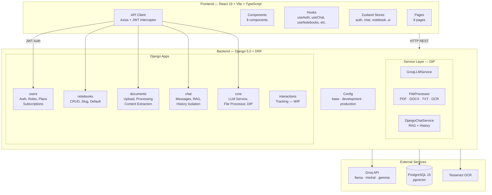
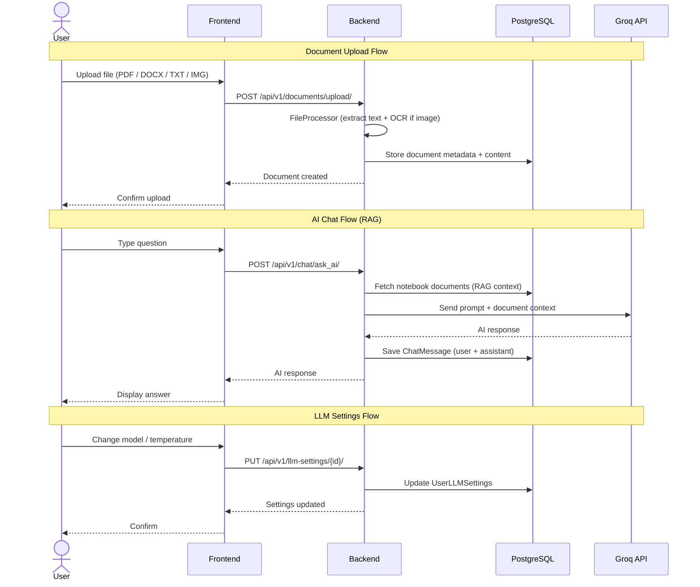
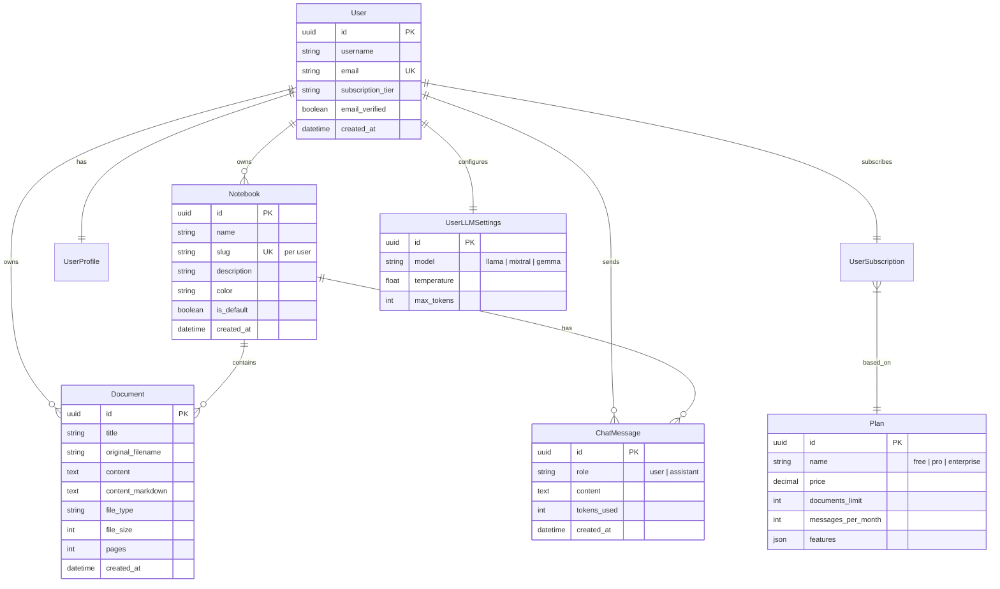

# 📊 PDF_IA_Rework — AI Document Analysis Platform

> **Fase 7 Completada: Aplicación lista para presentación** 🎉
>
> ⭐ **[Ver Checklist de Presentación](docs/PRESENTATION_CHECKLIST.md)** para demostración paso a paso
>
> Documentación del estado actual: [ESTADO_PROYECTO.md](docs/ESTADO_PROYECTO.md)

Full-stack application for intelligent document analysis with AI-powered chat. Built with **Django 5.0 + DRF**, **React 19 + TypeScript**, **Groq API**, and **i18next for internationalization**.


---

## ✨ Features

- **🌐 Internationalization (i18n)** — Full Spanish/English support with i18next
  - UI language switching via Settings page
  - Language persistence in localStorage
  - LLM responses in selected language
  
- **📓 Notebook System** — Dynamic notebooks with per-notebook chat isolation
- **🤖 AI Chat with RAG** — Context-aware answers using document content (Groq API)
- **📄 Multi-format Upload** — PDF, DOCX, TXT, images with OCR (Tesseract)
- **🔐 JWT Authentication** — Secure token-based auth with refresh + roles (Free/Premium/Admin)
- **⚙️ LLM Settings** — Configurable model, temperature, max tokens per user
- **🏗️ DIP Architecture** — Service layer with Dependency Inversion Principle
- **🐳 Docker Ready** — Full containerized setup with Docker Compose
- **💾 Auto-Save** — Automatic markdown saving with debouncing

---

## Architecture Diagram



---

## Data Flow Diagram



---

## Entity-Relationship Diagram



---

## 🚀 Quick Start

### Prerequisites

- **Docker & Docker Compose** (recommended)
- **Groq API Key** — Get a free key at https://console.groq.com/keys

Or for local development:
- **Python** 3.12+
- **Node.js** 18+
- **PostgreSQL** 15+ (port 5434)

### 🐳 Docker Compose (Recommended)

```bash
# Clone and navigate to project
git clone https://github.com/incognauta/CatIA.git
cd CatIA

# Configure environment
cp backend/.env.example backend/.env
# Edit backend/.env and add: GROQ_API_KEY=gsk_YOUR_KEY_HERE

# Start all services (PostgreSQL, Backend, Frontend)
docker compose up --build

# Access:
# Frontend: http://localhost:5173
# Backend:  http://localhost:8001/api/v1
# Database: localhost:5434
```

**Test credentials:**
- Email: `testuser@example.com`
- Password: `testpass123`

### 🌐 Testing Internationalization (i18n)

Once running:

1. Log in with test credentials
2. Navigate to **Settings (Configuración)**
3. Under "**Language**" section:
   - Select **English** from dropdown
   - Verify entire UI changes to English
   - Create/send a chat message
   - Observe LLM response in English
   - Change back to **Spanish** to confirm UI + LLM switch back

**Supported Languages:**
- 🇪🇸 **Spanish** (es) — Default
- 🇺🇸 **English** (en) — Full support

### Local Development

```bash
# Backend
cd backend
python -m venv venv && source venv/bin/activate
pip install -r requirements.txt
cp .env.example .env          # edit GROQ_API_KEY
python manage.py migrate
python manage.py runserver 0.0.0.0:8001

# Frontend (another terminal)
cd frontend
npm install --legacy-peer-deps
cp .env.example .env.local
npm run dev
```

---

## 📊 Phase 7 Completion Status

| Component | Status | Details |
|-----------|--------|---------|
| **i18n Infrastructure** | ✅ Complete | i18next + react-i18next + browser language detection |
| **Translation Files** | ✅ Complete | ~150+ keys in es.json + en.json (auth, chat, docs, notebooks, settings, etc.) |
| **Page Components** | ✅ Complete | DocsPage, NotebookPage, LoginPage, RegisterPage, DashboardPage translated |
| **Settings Page** | ✅ Complete | Language selector with localStorage persistence |
| **Backend Language Support** | ✅ Complete | Django accepts `language` param in chat API, passes to LLM |
| **LLM Language Adaptation** | ✅ Complete | System prompt modified with language-specific instructions for Groq |
| **Docker Build** | ✅ Complete | Backend & Frontend images built successfully |
| **Docker Services** | ✅ Complete | PostgreSQL, Django, React all containerized & working |
| **End-to-End Tests** | 🔄 In Progress | Language switching tested manually |

---

## Architecture

### Backend (Django 5.0 + DRF)

| Layer | Description |
|-------|-------------|
| **6 Apps** | `users`, `notebooks`, `documents`, `chat`, `core`, `interactions` |
| **Database** | PostgreSQL 15 with pgvector |
| **Auth** | JWT (SimpleJWT) — access 1h / refresh 7d with rotation |
| **Service Layer** | DIP pattern — abstract bases + concrete implementations |
| **File Processing** | PDF (PyMuPDF), DOCX (python-docx), TXT, images (Tesseract OCR) |
| **AI** | Groq API with RAG context (llama-3.1, mixtral, gemma) |
| **Tests** | 57+ passing tests (1,256 lines) across all apps |

### Frontend (React 19 + Vite + TypeScript)

| Layer | Description |
|-------|-------------|
| **UI** | TailwindCSS with CatIA palette (purple `#7C3AED`, pink `#EC4899`, gold `#F59E0B`) |
| **State** | Zustand with localStorage persistence — 4 stores (auth, chat, notebook, ui) |
| **Server State** | @tanstack/react-query for API data fetching & caching |
| **API Client** | Axios singleton with JWT Bearer interceptor + 401 auto-logout |
| **Pages** | 8 pages — Login, Register, Dashboard, Notebook, Docs, Settings, Help, ComingSoon |
| **Components** | 8 components — Sidebar, Header, ChatSidebar, ChatMessage, ChatSettings, NotebookCanvas, DocumentsModal, RootLayout |
| **Hooks** | 6 custom hooks — useAuth, useNotebooks, useNotebook, useChat, useDocuments, useLLMSettings |

---

## Technology Stack

| Layer | Technology | Status |
|-------|-----------|--------|
| **Backend** | Django 5.0, DRF 3.14, PostgreSQL 15 | ✅ Production |
| **Frontend** | React 19, Vite 5, TypeScript, TailwindCSS 3.4 | ✅ Production |
| **AI Engine** | Groq API (llama-3.1, mixtral, gemma) | ✅ Integrated |
| **Auth** | SimpleJWT, Bearer tokens, roles (Free / Premium / Admin) | ✅ Implemented |
| **State** | Zustand + @tanstack/react-query | ✅ Implemented |
| **API Client** | Axios + auto-refresh interceptor | ✅ Implemented |
| **File Processing** | PyMuPDF, python-docx, Tesseract OCR, Pillow | ✅ Implemented |
| **Deploy** | Docker, Docker Compose | ✅ Ready |
| **Architecture** | DIP Service Layer, Repository Pattern | ✅ Fase 7 |

---

## API Reference

### Health
```
GET  /health/
```

### Authentication — `/api/v1/auth/`
```
POST  /auth/register/        Register + JWT
POST  /auth/login/            Login + JWT
```

### Users — `/api/v1/users/`
```
GET   /users/me/              Profile
PUT   /users/me/              Update profile
GET   /users/                 List (admin only)
```

### Notebooks — `/api/v1/notebooks/`
```
GET    /notebooks/                           List
POST   /notebooks/                           Create
GET    /notebooks/{id}/                      Detail
PUT    /notebooks/{id}/                      Update
DELETE /notebooks/{id}/                      Delete
GET    /notebooks/{id}/documents/            Documents in notebook
GET    /notebooks/{id}/chat_history/         Chat history
```

### Documents — `/api/v1/documents/`
```
GET    /documents/                           List
POST   /documents/                           Create
GET    /documents/{id}/                      Detail
PUT    /documents/{id}/                      Update
DELETE /documents/{id}/                      Delete
POST   /documents/upload/                    Upload file (multipart)
GET    /documents/{id}/content/              Full extracted text
```

### Chat — `/api/v1/chat/`
```
GET    /chat/                                List messages
POST   /chat/                                Create message
GET    /chat/{id}/                           Message detail
PUT    /chat/{id}/                           Update message
DELETE /chat/{id}/                           Delete message
POST   /chat/ask_ai/                         Ask AI (with RAG context)
GET    /chat/history/?notebook={id}          Conversation history
DELETE /chat/clear_history/?notebook={id}    Clear history
```

### LLM Settings — `/api/v1/llm-settings/`
```
GET    /llm-settings/                        Get user settings
PUT    /llm-settings/{id}/                   Update settings
PATCH  /llm-settings/{id}/                   Partial update
GET    /llm-settings/defaults/               System defaults
POST   /llm-settings/reset/                  Reset to defaults
```

---

## Environment Variables

| File | Variable | Required | Default |
|------|----------|----------|---------|
| `backend/.env` | `GROQ_API_KEY` | Yes | — |
| | `SECRET_KEY` | Yes | Auto-generated |
| | `DATABASE_URL` | No | PostgreSQL on localhost:5434 |
| | `CORS_ALLOWED_ORIGINS` | No | `http://localhost:5173` |
| `frontend/.env.local` | `VITE_API_BASE_URL` | No | `http://localhost:8001/api/v1` |

---

## Project Structure

```
PDF_IA_Rework/
├── backend/
│   ├── config/
│   │   ├── settings/
│   │   │   ├── base.py
│   │   │   ├── development.py
│   │   │   └── production.py
│   │   ├── urls.py
│   │   ├── wsgi.py
│   │   └── asgi.py
│   ├── apps/
│   │   ├── users/             # Auth, roles, plans, subscriptions
│   │   ├── notebooks/         # Notebook CRUD
│   │   ├── documents/         # Upload, processing, management
│   │   ├── chat/              # Messages, RAG, AI
│   │   ├── core/              # LLM service, file processor, DIP
│   │   └── interactions/      # Tracking (WIP)
│   ├── manage.py
│   ├── requirements.txt
│   ├── Dockerfile
│   └── .env.example
├── frontend/
│   ├── src/
│   │   ├── pages/             # 8 pages
│   │   ├── components/        # 8 components
│   │   ├── hooks/             # 6 custom hooks
│   │   ├── stores/            # 4 Zustand stores
│   │   ├── api/               # Axios client + services
│   │   └── types/             # TypeScript definitions
│   ├── package.json
│   ├── vite.config.ts
│   ├── Dockerfile
│   └── .env.example
├── docker-compose.yml
├── setup.sh
├── start.sh
├── SCRIPTS_GUIDE.md
├── .gitignore
├── README.md
└── docs/
    ├── ARCHITECTURE_DIAGRAMS.md
    ├── ESTADO_PROYECTO.md
    ├── IMPROVEMENT_PLAN.md
    ├── PHASE_7_SIMPLIFIED.md
    ├── PHASE_7_PRODUCTION_ROADMAP.md
    └── ...
```

---

## 📋 Current Status

### ✅ Completed (Fase 5 → 7)

**Core Features:**
- Full backend API with 57+ passing tests (1,256 lines)
- React 19 frontend with 8 pages, 8 components, 6 hooks, 4 stores
- JWT authentication with token refresh and role-based access
- Notebook CRUD with dynamic creation and per-notebook isolation
- Multi-format document upload (PDF, DOCX, TXT, images + OCR)
- AI Chat with RAG context via Groq API (3 model options)
- User LLM settings (model, temperature, max tokens)
- DIP architecture with service layer and abstract base classes
- Docker Compose with PostgreSQL 15

**Fase 7 — Internationalization (i18n):**
- ✅ i18next infrastructure (client-side detection + localStorage persistence)
- ✅ 150+ translation keys across Spanish/English
- ✅ Language selector in Settings page
- ✅ Backend language parameter support in chat API
- ✅ LLM system prompt modification for language-specific instructions
- ✅ Docker images built and services running

### 🔜 Upcoming

- **i18n Refinement** — Component-level fine-tuning and more UI pages
- Interactions app — full tracking system for analytics
- Async Groq API calls — non-blocking AI responses
- Rate limiting — per-user request throttling
- Production deployment — gunicorn + nginx + SSL
- Real-time collaboration
- Payment integration (Stripe)

### ⚠️ Known Issues

| Issue | Status | Notes |
|-------|--------|-------|
| Language UI sync in some cases | 🔄 Investigating | State management for i18n may need fine-tuning in complex components |
| HelpPage not translated | 🔄 Pending | Large FAQ component needs systematic key replacement |
| ComingSoonPage not translated | 🔄 Pending | Minor page, low priority |
| Page refresh loses i18n state | 🔄 Fixed | localStorage persistence should maintain language selection |

---

## 🐛 Troubleshooting

| Issue | Solution |
|-------|----------|
| Backend won't start | Run `python manage.py migrate` inside container or locally |
| API 404 errors | Check `CORS_ALLOWED_ORIGINS` in backend `.env` |
| Node modules too large | Use `--legacy-peer-deps` flag for React 19 compatibility |
| Groq API not working | Verify key at https://console.groq.com/keys and check API status |
| File upload fails | Check file size (max 10MB) and format (PDF/DOCX/TXT/IMG) |
| Language not switching | Clear browser cache and localStorage, reload page |
| Docker build fails | Run `docker compose build --no-cache` to force rebuild |

---

## � Documentation

| Document | Purpose |
|----------|---------|
| [PRESENTATION_CHECKLIST.md](docs/PRESENTATION_CHECKLIST.md) | **⭐ Start here for demo** — Step-by-step guide for presentation |
| [DEPLOYMENT.md](docs/DEPLOYMENT.md) | Deployment options (Docker, Render, AWS, K8s) |
| [ESTADO_PROYECTO.md](docs/ESTADO_PROYECTO.md) | Project status and completion by phase |
| [ARCHITECTURE_DIAGRAMS.md](docs/ARCHITECTURE_DIAGRAMS.md) | System architecture diagrams |
| [docs/Progreso/](docs/Progreso/) | Detailed phase-by-phase implementation notes |

---

## 📞 Support & Contact

For issues, questions, or suggestions:
- **🎬 Want to demo?** → See [PRESENTATION_CHECKLIST.md](docs/PRESENTATION_CHECKLIST.md)
- **🚀 Need to deploy?** → See [DEPLOYMENT.md](docs/DEPLOYMENT.md)
- 📊 Check [ESTADO_PROYECTO.md](docs/ESTADO_PROYECTO.md) for current project state
- 📁 Review [docs/Progreso/](docs/Progreso/) for detailed phase documentation
- 🐛 Open an issue on GitHub: [incognauta/CatIA](https://github.com/incognauta/CatIA/issues)

---

## License

MIT
