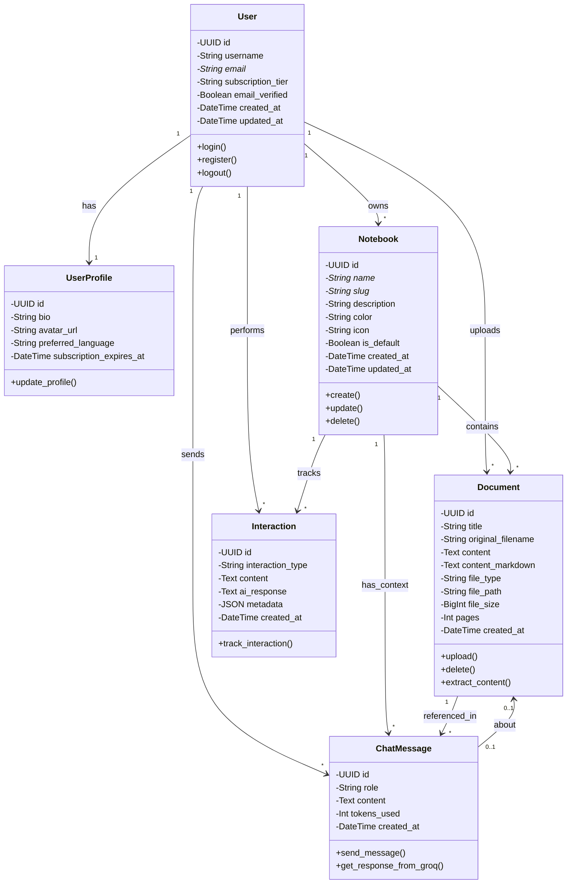
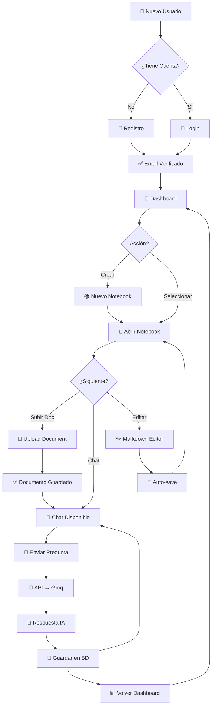
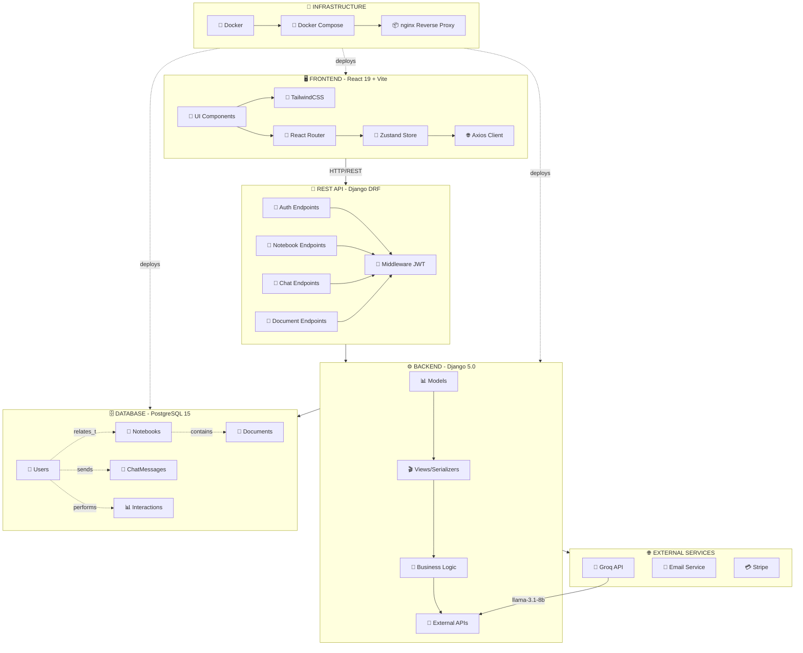

# Diagramas de Arquitectura - PDF_IA_Rework

Este documento contiene los diagramas principales del proyecto: clases, flujo y arquitectura.

---

## 📊 Diagrama de Clases



### 📝 Explicación Diagrama de Clases

| Clase | Descripción | Cardinalidad |
|-------|-------------|--------------|
| **User** | Usuario del sistema (extiende AbstractUser) | Entidad Principal |
| **UserProfile** | Perfil extendido (1-a-1 con User) | Datos Adicionales |
| **Notebook** | Contenedor lógico para documentos | 1 user → * notebooks |
| **Document** | Documento cargado por usuario | 1 notebook → * documents |
| **ChatMessage** | Mensaje en conversación con IA | 1 user → * messages |
| **Interaction** | Tracking de interacciones del usuario | 1 user → * interactions |

**Relaciones Clave:**
- `User` es la entidad central que se relaciona con todas las demás
- `Notebook` agrupa `Document` y `ChatMessage`
- `ChatMessage` puede referenciar un `Document` (opcional)

---

## 🔄 Diagrama de Flujo - Interacción Usuario



### 🎯 Flujo Principal

1. **Autenticación** (5 min)
   - Registro con email
   - Login con credenciales
   - Email verificado

2. **Dashboard** (2 min)
   - Listar notebooks
   - Crear nuevo notebook
   - Seleccionar notebook existente

3. **Editor Notebook** (10 min)
   - Upload de documentos
   - Chat con IA
   - Edición markdown

4. **Chat Loop** (∞)
   - Enviar pregunta
   - API procesa → Groq AI
   - Guardar respuesta en BD
   - Volver al chat

---

## 🏗️ Diagrama de Arquitectura



### 🎯 Capas de Arquitectura

#### 1️⃣ **Frontend (React 19 + Vite)**
- **Components**: UI reutilizable (Login, Dashboard, Chat)
- **Styling**: TailwindCSS + CatIA palette
- **Routing**: React Router v6 con guard de autenticación
- **State Management**: Zustand con 3 stores (auth, chat, notebook)
- **HTTP Client**: Axios con interceptor JWT

#### 2️⃣ **REST API (Django DRF)**
- **Auth**: POST /api/v1/auth/login/, /register/
- **Notebooks**: CRUD endpoints
- **Chat**: POST /ask_ai/, GET /history/
- **Documents**: Upload/Delete
- **Security**: JWT middleware en todos los endpoints

#### 3️⃣ **Backend Business Logic (Django)**
- **Models**: User, Notebook, Document, ChatMessage, Interaction
- **Serializers**: Validación y transformación de datos
- **Views**: APIView y ViewSet para CRUD
- **Managers**: Lógica de negocio (filtrados, búsquedas)

#### 4️⃣ **Database (PostgreSQL 15)**
- **Users**: Autenticación y perfiles
- **Notebooks**: Contenedores de documentos
- **Documents**: Archivos y contenido
- **ChatMessages**: Conversaciones con IA
- **Interactions**: Tracking de eventos

#### 5️⃣ **External Services**
- **Groq AI**: llama-3.1-8b-instant para respuestas
- **Email**: Verificación de email
- **Stripe**: Pagos (Fase 6)

#### 6️⃣ **Infrastructure (Docker)**
- **Docker**: Contenedores para Frontend, Backend, PostgreSQL
- **Docker Compose**: Orquestación de servicios
- **nginx**: Reverse proxy y balanceo

---

## 🔌 Endpoints de API

### Auth
```
POST   /api/v1/auth/login/           - Login (usuario + password)
POST   /api/v1/auth/register/        - Registro (usuario + email + password)
POST   /api/v1/auth/refresh/         - Refresh JWT token
```

### Notebooks
```
GET    /api/v1/notebooks/            - Listar notebooks del usuario
POST   /api/v1/notebooks/            - Crear notebook
GET    /api/v1/notebooks/:id/        - Detalles del notebook
PUT    /api/v1/notebooks/:id/        - Actualizar notebook
DELETE /api/v1/notebooks/:id/        - Eliminar notebook
```

### Chat
```
POST   /api/v1/chat/ask_ai/          - Enviar pregunta (con AI)
GET    /api/v1/chat/history/         - Historial de mensajes
```

### Documents
```
POST   /api/v1/documents/            - Subir documento
GET    /api/v1/documents/            - Listar documentos
DELETE /api/v1/documents/:id/        - Eliminar documento
```

---

## 🔐 Flujo de Autenticación

```
1. Frontend: POST /auth/login/ { email, password }
   ↓
2. Backend: Valida credenciales, genera JWT tokens
   ↓
3. Response: { access, refresh, user }
   ↓
4. Frontend: Guarda tokens en localStorage (Zustand)
   ↓
5. Request siguientes: Header "Authorization: Bearer {access_token}"
   ↓
6. Si 401: Automáticamente refresh con refresh_token
   ↓
7. Si expira refresh: Redirect a login
```

---

## 📦 Dependencias Clave

### Backend
- `django==5.0`
- `djangorestframework==3.14`
- `djangorestframework-simplejwt`
- `psycopg2-binary` (PostgreSQL)
- `groq` (IA API)

### Frontend
- `react==19`
- `vite==5`
- `typescript`
- `tailwindcss`
- `zustand`
- `axios`
- `react-router-dom`

---

## 🚀 Estado del Proyecto (Fase 5)

| Feature | Status | % Completado |
|---------|--------|--------------|
| Authentication | ✅ Completo | 100% |
| Notebook CRUD | ✅ Completo | 100% |
| Document Upload | ✅ Completo | 100% |
| Chat con IA | ✅ Completo | 100% |
| Auto-save | ✅ Completo | 100% |
| Markdown Editor | ✅ Completo | 100% |
| Storage Quotas | 🔜 Próximo | 0% |
| Payments | 🔜 Fase 6 | 0% |
| Production Deploy | 🔜 Fase 7 | 0% |

---

## 📚 Referencias

- [GIT_STRATEGY.md](GIT_STRATEGY.md) - Estrategia de git
- [PRE_PUSH_CHECKLIST.md](PRE_PUSH_CHECKLIST.md) - Checklist pre-push
- [README.md](../README.md) - Documentación principal
